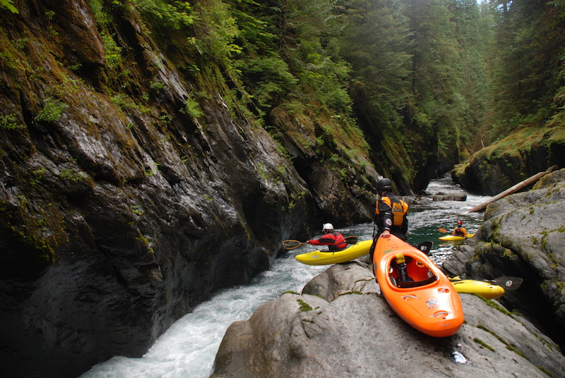
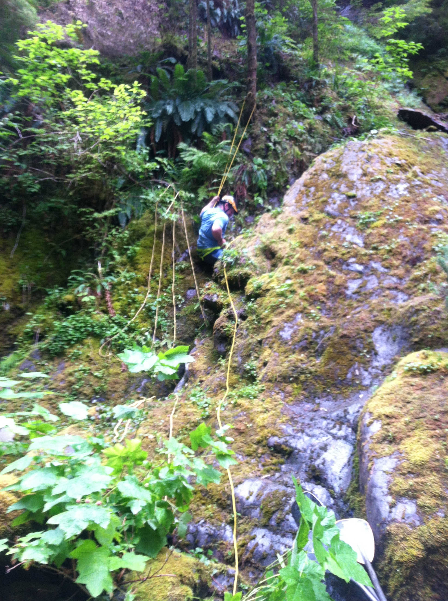
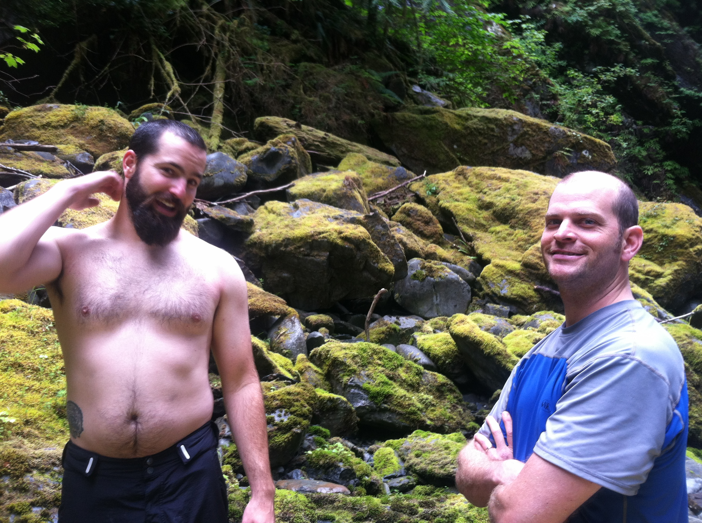

Earlier this month I was fortunate enough to journey out to the Quinault river,
on the [southwest
side](https://www.google.com/maps/preview#!q=Graves+Creek+Campground&data=!1m4!1m3!1d12674!2d-123.5797121!3d47.5723791!2m1!1e3!4m10!1m9!4m8!1m3!1d811145!2d-123.5807115!3d47.5706261!3m2!1i1029!2i904!4f13.1&fid=7)
of the Olympic National Park. The river is very inaccessable, but the canyon is
pretty enough to be well worth it.

We left from the Graves Creek Campground around 10 am and started hiking
towards Pony Creek Falls. I was able to borrow a homemade kayak backpack rig,
which made the trip much easier by distributing the weight over my hips and
shoulders.

At about two miles, one hour, we made it to an old picnic table and started
following an elk trail Mike Hoover found that puts you just below the first set
of class V rapids. It's tricky to follow, but after nearly an hour we found the
correct gully leading down to the river and started lowering boats.

Eventually, at about one o'clock, we were at the river. It's incredible.

Especially after the descent, the canyon feels remote. At times sheer rock
soars up close to 300 feet on either side. The water is clear enough to make
out fish below and rocks fifteen feet below. Waterfalls pour into the river and
the rocks have been polished and shaped by the water. This makes scouting a bit
scary, as it's difficult to get a grip when walking, and evidence of undercuts
are everywhere.

The river is not terribly technically difficult, but consequences could be bad
if an accident happened. I shudder to think about hiking out. The gauge read
660 cfs on this trip, but a good foot higher would have been perfect. We were
bumping rocks the entire time as it was, and a few rapids were too low for
comfort.

Our one scary incident was about a third of the way through, when Stephen
pinned his boat in an undercut slot. We were able to pull him out with a rope
before he fell in, but the boat took a good hour to work out. We ended up
pushing it deeper and letting it flush under the rock.

We made it out close to five o'clock. The takeout was at our campsite just
after the Graves Creek confluence, so there's no hike out, a huge relief.

If you ever have the chance to do this run, take it. It's gorgeous, and with
the right water would be a fantastic stretch of whitewater.

Checkout the [trip report on American
Whitewater](http://www.americanwhitewater.org/content/Report/detail/id/885045/)
and [Stephen's video on Vimeo](https://vimeo.com/72695828).

<iframe src="//player.vimeo.com/video/72834549" width="500" height="281"
frameborder="0" webkitallowfullscreen mozallowfullscreen
allowfullscreen></iframe> 
<a href="http://vimeo.com/72834549">Quinault</a>
from <a href="http://vimeo.com/apexskier">Cameron Little</a> on <a
href="https://vimeo.com">Vimeo</a>.

