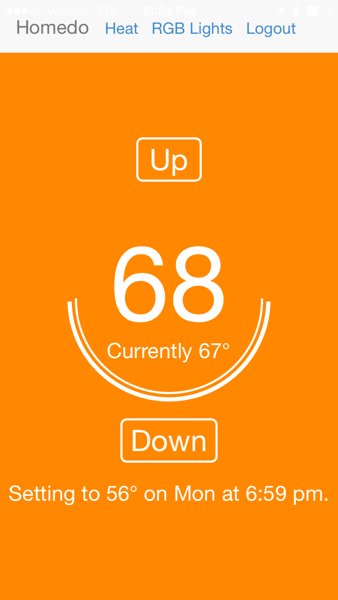
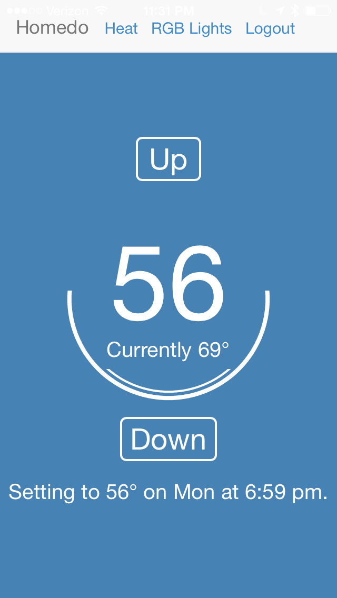
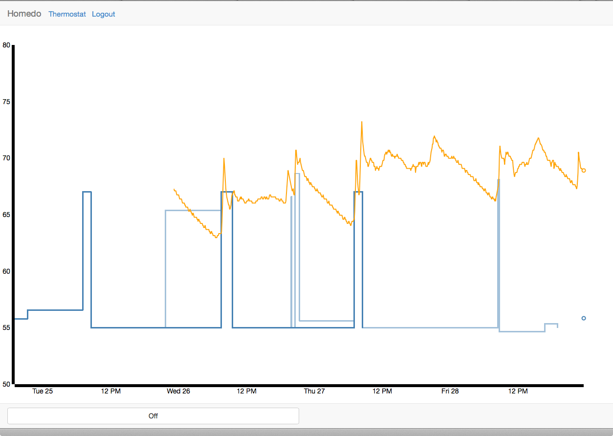
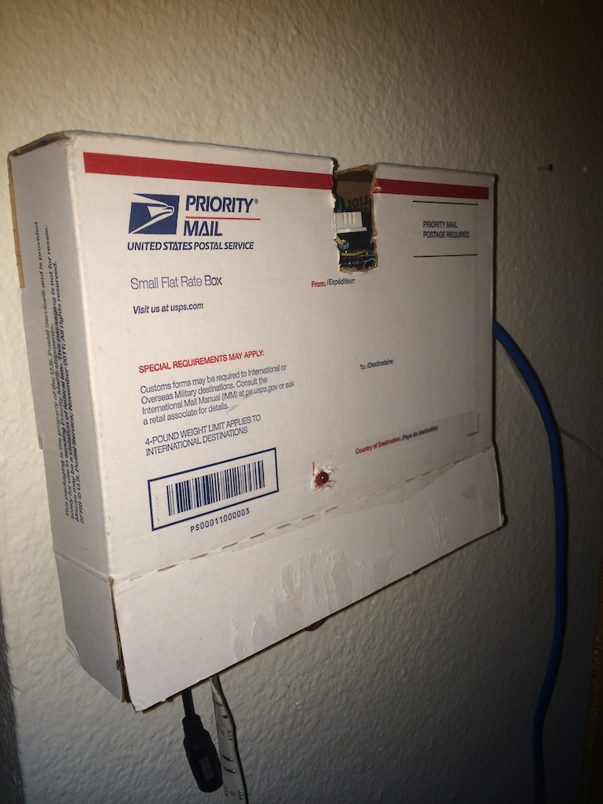
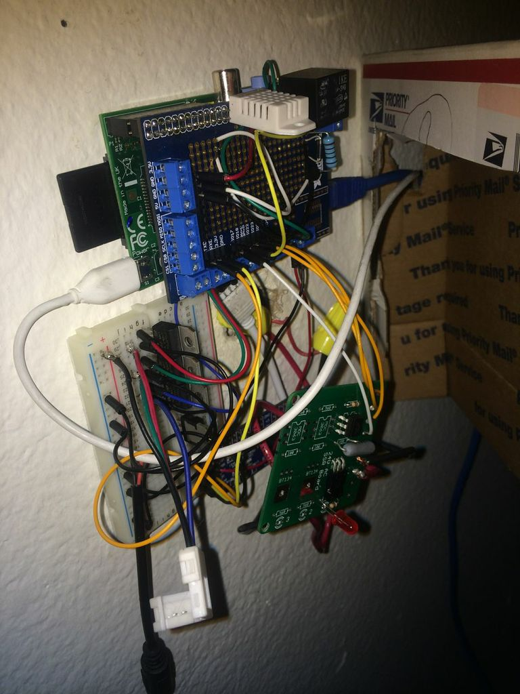

After playing with my Raspberry Pi for the better part of the year, I'd been
wanting to do something that takes advantage of the Pi's hardware. What follows
is a description of the home automation system I've built so far, called
[Homedo](https://github.com/apexskier/homedo).

## Inspiration

I live in a small apartment, so it's hard to do much interfacing with the house
without violating my lease by ripping holes in the walls. It was really cold
this winter, so I decided to try upgrading out thermostat. The existing one was
as basic as I can imagine: just a basic [temperature controlled
switch](http://en.wikipedia.org/wiki/Thermostat#Simple_two_wire_thermostats)
opening and closing the circuit to our living room's baseboard heater.

## Hardware

Before this project I hadn't messed with physical circuits since my elementary
school days and some simple connect the dots type kits. I did quite a bit of
breadboarding and testing in order to avoid burning down the house or burning
out my Pi (whoops). This [article about driving a
relay](http://www.susa.net/wordpress/2012/06/raspberry-pi-relay-using-gpio/)
helped a ton, along with tutorials by Adafruit. I eventually ordered a pcb from
[Nich
Fugul](http://makeatronics.blogspot.com/2013/06/24v-ac-solid-state-relay-board.html)
and some components from Digikey to interface with the household wiring.

I've got a few circuits set up on the Pi currently: gpio to the pcb, gpio to a
lower current relay, and gpio to an Adafruit I2C controller for some [led
lights](https://github.com/apexskier/ledDriver).

## Software

I wanted to create something intelligent, similar to the Nest, that would make
my life easier. This involves stuff I know nothing about: machine learning.

To get the familiar code out of the way, I wrote the basic thermostat in
Python, using the WiringPi2 library and the Bottle web framework to put it
online. The user interface uses gevent-websockets for real time information and
updating.

### Intelligence

My machine learning algorithm went through several iterations. Initially my
algorithm simply checked the temperature every five minutes, compared it to
what it knew about, and updated a confidence measurement and a target
temperature. There's a number of issues with this approach that became apparent
quickly. The main one is that when I change the temperature, five minutes later
the learner changes it back.

My seconds approach introduced the ideas of events. The learner keeps a list of
events it's seen, and when it sees a user set temperature action searches for a
similar event. If it finds one, that event is given a change change, which then
is saved if it's seen multiple times. If not, a new event is saved with a
degree of uncertainty, which then can be saved for certain if repeated.

This approach was much better, but has scalability issues, especially on the
limited capacity of a Raspberry Pi. I realized that the only information I need
to know to track events is what event just happened and what event is next.
Anything the user does won't affect any other event. The natural solution for
this is a circular doubly linked list. With this solution I only need to keep a
pointer to the last event. I can walk the list to not only see the next
'certain' event, but any 'uncertain' ones in between. I don't need to know how
many events there are or anything about any other event at any time.  When an
event happens, I simply schedule the next one to happen at it's specified time.

When an unexpected event happens (the user gives input), my program can check
if it's close to the last or next event and make an appropriate adjustment,
cancelling the next event if necessary. If not, I can insert a new uncertain
event into the chain, for saving if something similar happens on the next walk
through. I've also got logic that accounts for the user changing their mind,
and making minor adjustment.

## User interface

I've built a web based user interface using the [D3.js](http://d3js.org)
javascript library and a little bit of [Bootstrap](http://getbootstrap.com).
The main thermostat control shows the current target temperature, the current
temperature, and the next scheduled change. There's also a data page, showing a
graph of the house's temperature over the last week, the schedule, and various
user set events not saved as certain.

## Using it in the real world

I've had the thermostat running for a couple weeks, and the machine learning
stuff for about a week. I'm still fixing bugs, and with the amount of variation
and concurrency involved there's guaranteed to be more. However, it's working
well, and has been a great learning experience. I've got a few more ideas for
improving my learning algorithms, and I'd like to improve my system for keeping
the heat in the house even, but I'm very proud of where I'm at so far.

Check out the project [on GitHub](https://github.com/apexskier/homedo).

---

---

---

