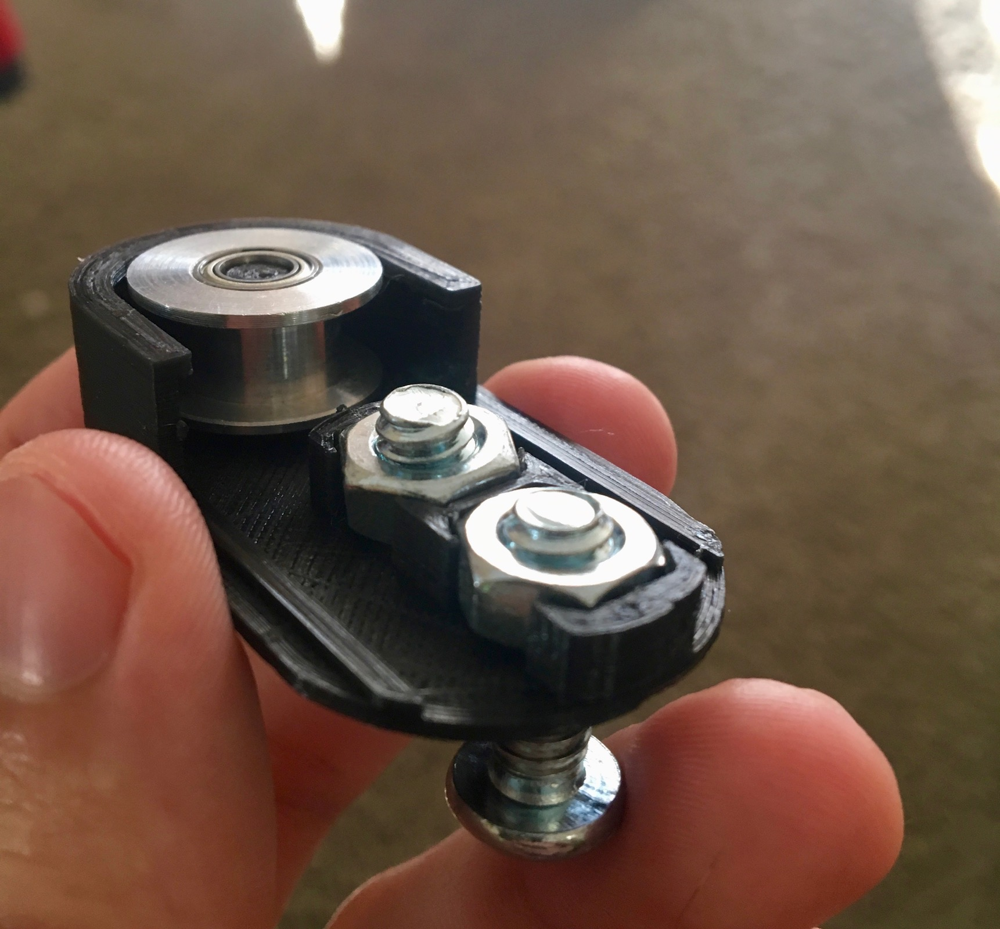
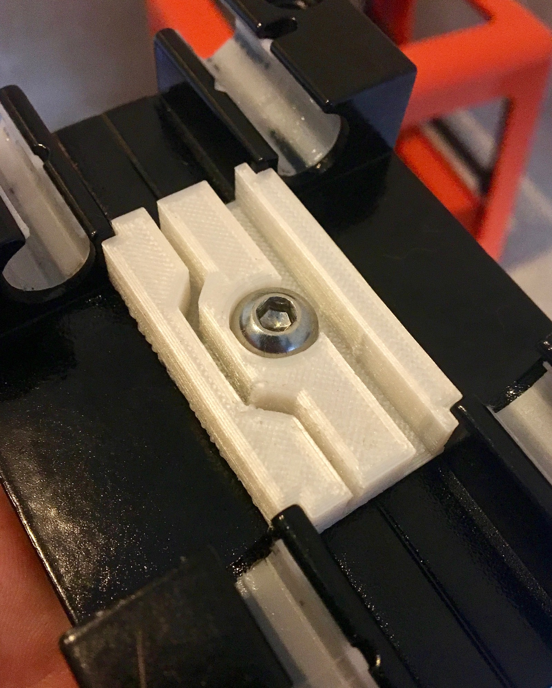
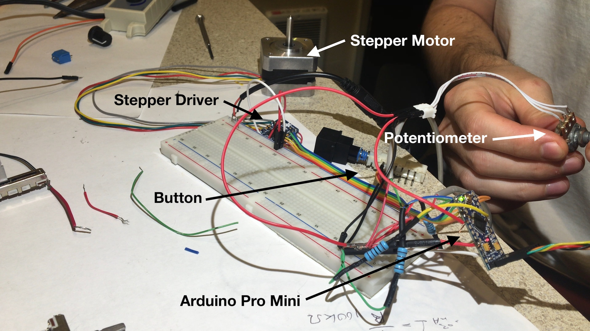
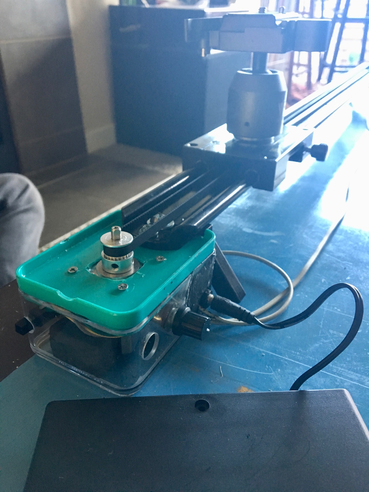

Earlier this year my friend Cole approached me about motorizing his [video
slider](https://www.google.com/search?q=video+slider&source=lnms&tbm=isch&sa=X&ved=0ahUKEwjxmMu1xdvQAhWDLmMKHajvCK8Q_AUICigD&biw=1280&bih=699&dpr=2).
Even though the project took far too long to finish, I'm very happy with the
results.

The project ended up involving a bunch of fun stuff I didn't have much
experience with, including 3D printing, Arduino, and driving a motor. The final
project self calibrates on startup, has variable speed, and is battery powered.
The slider can oscillate back and forth or move in a single direction.

[Example Parts List](http://www.adafruit.com/wishlists/420479)

[Source Code and Model files](https://github.com/apexskier/slider)

## 3D Printing

I've been using [OpenSCAD](http://www.openscad.org/) to model my prints.

<figure>
    <video src="pully-timelapse.mov" width="420" controls muted></video>
    
    <figcaption>Pully mount for the far end of the slider</figcaption>
</figure>

<figure>
    <video src="slider-mount-timelapse.mov" width="420" controls muted></video>
    
    <figcaption>Timing belt mount for the camera platform</figcaption>
</figure>

## Arduino

I decided on an Arduino Pro Mini because of its small size. I had no need for
internet connectivity so the feature set of the Mini worked well.

The basic structure of the code is a state machine. Each program loop watches
global variables and listens to events to determine how to drive the motor.
For more information, check out the [project on
GitHub](https://github.com/apexskier/slider).

Switches on either end of the slider are used for initial calibration, as a
safeguard throughout operation, and to trigger single directional movement. A
potentiometer sets speed and a button starts and stops oscillation.

## Final Product

<figure>
    
</figure>

Take a look at Cole's [Instagram](https://www.instagram.com/coleparamoredrums/)
or [YouTube](https://www.youtube.com/user/cole2paul) to see some shots from the
final product.



### What I Learned

I was worried about excessive vibration and noise, but it's not noticeable
especially when using a heavier camera.

This was my first big 3D printing project, and I had more trouble than I'd
like. This was mostly due to the cheapness of my printer: slow prints, not
great accuracy, and pretty terrible software. I also had to figure out how much
spacing to account for when printing pieces that fit together. I think the rule
I found was `.2mm` for a tight fit and `.4mm` for loose.

The biggest issue I had was when attempting to print large surfaces, like an
enclosure for the controls. I had some major warping issues; I think a heated
bed would help. After deciding to use a pre-built box instead of a custom one,
I ended up cracking it a few times before figuring out a good drilling
technique.

