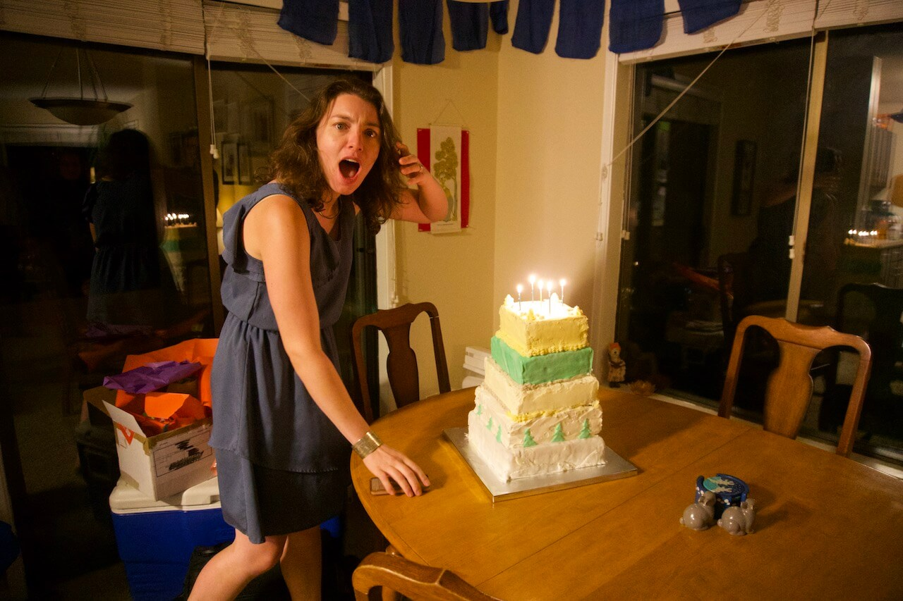

I [got married](http://localhost:1313/posts/wedding-website/) last May (2019), and one of my main duties was making our wedding cake, which was a big undertaking.

The idea started back in August or September of 2018, as we were approaching Aisha's birthday. I've done quite a bit of baking over the years and Aisha, only half joking, requested a five-tier cake for her birthday. I decided I was up for the challenge and spend two-and-a-half _days_ making one. We'd been talking about the possibility of me making our wedding cake, so I decided to go all out and try a few new things. I ended up making a 25-pound, 5 tier cake with four different types of frosting (Italian meringue buttercream, French meringue buttercream, marshmallow based fondant, and stabilized whipped cream) and four different fillings (homemade blackberry jam, lemon curd, lavender buttercream, whipped chocolate ganache) in the layers. I also used a cake batter that required pre-heating milk and baking from a hot liquid batter.

Overall it was a bit rough around the edges. I didn't make enough fondant or frosting, I only had green food coloring, I didn't have quite the right tools---but the scale made up for it. 

After this first tiered cake, we committed---I was going to make our wedding cake.

We agreed that I'd try to make one cake each month until the wedding, which meant about six full sized cakes, most of which were eaten by Aisha and my coworkers.



Throughout this process I learned more about what's special about a _wedding_ cake and I fine-tuned my plans for the real thing. Wedding cakes need to be liked by everyone, they need to be able to sit around for a long time, and they need to look good.

For the flavor, we decided to go simple with broad appeal. We decided on a standard white sponge flavored with vanilla. Since I was doing this myself, I decided to do several different filling types (we weren't paying for the additional complexity). We went with a seedless raspberry jam on the bottom, a whipped chocolate ganache on the second tier, and lemon curd plus lavender on the top two tiers (for something more unique).

For cake durability, the main factor is frosting. Certain types, like those with raw eggs (meringue based) or cream cheese, risk food-borne illnesses after more than half a day or so. Others, like American buttercream (made with powdered sugar), develop an unpleasant crust after exposed to air for a few hours. Aisha also doesn't love excessively sweet or buttery frosting. Pretty early into process I discovered [ermine icing](https://cooking.nytimes.com/recipes/1016330-ermine-icing)---also known as boiled milk frosting---and decided that it was perfect. Ermine frosting is stable for several days, doesn't dry out, and has a more complex flavour than most other buttercreams. During our wedding venue's open house one of the vendors affirmed my choice, and also advised me to bake three days before the event.

For appearance, I knew I couldn't get too fancy. My piping and decorating skills are not high. I decided to take advantage of my precision and patience---the qualities that make a good baker. We decided on a gray (Aisha's [favorite color](https://genius.com/11503998)) ombre effect without additional frills. I also invested in some nicer frosting spatulas, cake pans, tier supports to make sure the cake would be straight and even.

Three weeks before the wedding I did a full trial run. I made the jam and lemon curd, baked eight sets of cakes (four tiers × four layers ÷ two pans in the oven at a time), cooled, assembled, stacked, crumb-coated, frosted, ombre'd, and finished after about a day and a half. I didn't aim for perfection in the trial, but focused on refining the process. I also tested out the most expensive part of this project, an [insulated cake porter](https://www.amazon.com/gp/product/B00WQUOTN6/ref=ppx_yo_dt_b_search_asin_title?ie=UTF8&psc=1). Luckily, my base was the same interior dimensions at 14 inches square. This provided a lot more stability because there wasn't opportunity for sliding.



The week leading up to the wedding I prepared the jam and lemon curd, since they were able to keep in the fridge. The day before baking, I boiled the milk for my frosting, since cooling was very important. On Friday, three days before the Sunday wedding, I managed to get the entire cake completed in around 10 hours.
The day of the wedding I smoothed out a final few rough spots on the frosting, added some floral decorations, and added some cake toppers---our ceramic rabbit salt and pepper shakers.

Overall, this was a very rewarding experience, both in experience, tastiness, and sheer amount of cake.

---



---

### Raw notes

If you've made it this far, you might be interested in my raw notes, including to the recipes I followed.

Wedding cake

6x raspberry jam
Lemon curd, set more
Make curd and jam ahead of time (Monday or Wednesday)
Boil milk day before (Thursday)
Pre cool carrier
Dowels in each layer (remember the middle!)
Make sure layers aren’t too high

#### Ingredients

##### Cake layers
- 36 eggs
- 6 cups milk
- 2 tablespoons vanilla
- 3 lbs 6 oz cake flour
    - 4+ tablespoons cornstarch
- 4 lbs 9.5 oz sugar
- .5 cup baking powder
- 2 tablespoons salt
- 9 sticks butter

##### [Ermine Frosting](https://cooking.nytimes.com/recipes/1016330-ermine-icing)
- 6 cups milk
- 2 cups less 2 tablespoons flour
- 2 tablespoons vanilla
- 6 pinches salt
- 12 sticks butter
- 6 cups sugar

##### [Lemon curd](https://www.twopeasandtheirpod.com/lemon-curd/)
- 3 eggs
- 1 cup sugar
- 1/2 cup lemon juice
- 1/2 stick butter
- 1 tablespoon lemon zest

##### [Raspberry Jam](https://www.geniuskitchen.com/recipe/raspberry-cake-filling-152347?ref=amp)
- 9 cups frozen raspberries
- 6 tablespoons cornstarch 
- 3/4 cup lemon juice (bump up to 1 cup)
- 1 1/2 cup sugar

##### [Chocolate Mousse](https://www.ricardocuisine.com/en/recipes/7472-chocolate-mousse-cake)
- 7 oz dark chocolate 
- <1 pack gelatin
- 2 tablespoons water
- 1/2 cup sugar
- 2 cups heavy cream

#### Shopping List
- [x] 39 eggs
- [x] 1 gallon milk
- [x] 1 pint heavy cream
- [x] 22 sticks butter (~6 packs)
- [x] 5 lbs flour
- [x] Cornstarch
- [x] 8 lbs sugar
- [x] 1/2 cup baking powder
- [x] Vanilla extract
- [x] Gelatin
- [x] Salt
- [x] 4 lemons
- [x] 2.25 pounds raspberries
- [x] 7 oz dark chocolate 
- [x] 3 oz cooking lavender 
  
 

- [x] Cardboard rounds
- [x] Dowels

