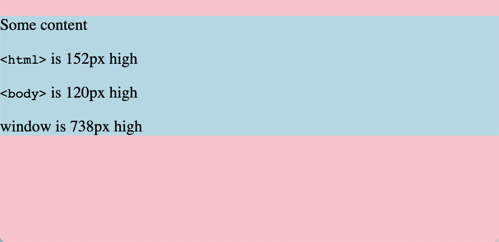

You may have heard about the [`overscroll-behavior`](https://developer.mozilla.org/en-US/docs/Web/CSS/overscroll-behavior) css property. It allows you to disable the default behavior when someone scrolls beyond the bounds of your website.


But maybe you don't want to disable that nice physics interaction and want to have some fun with it instead. The goal here is to use css to add some sort of "hidden" content in the background of the site that's only visible when over-scrolling.

By default, there are already two elements to play with: `<html>` and `<body>`. The first thing to understand is the sizing of these elements. Both element's intrinsic content size is that of the containing content, but the `<html>` element is special, since its _background_ takes up the full window size.

[](https://codepen.io/apexskier/pen/WNQgNQp)

First, I want to make sure the `<body>` always covers the full content, so I don't have anything in the background of the `<html>` peeking out at the bottom. I also need to make sure my layout doesn't have any margins collapsing outside of the body, which in this demo I'll do by making my body `flex`.

```css
body {
	min-height: 100vh; /* full height */
	display: flex; /* optional - prevents margin collapse */
}
```

With a background color on the `<html>` element it's visible when I overscroll. However, this is "fake" content on desktop browsers---the html is still scrolling so its _contents_ aren't shown (for example, a background image).

<!-- TODO video -->

There are a couple of approaches I want to try to get content in there.

1. Don't scroll the html - scroll the body instead

Unfortunately (at least in the desktop browsers I tested) this doesn't work as I want. The only element that allows scrolling outside of its content is the `<html>` tag, so the behavior is the same as if I set `overscroll-behavior: none`.

```css
html {
	overflow: hidden;
}

body {
	overflow: scroll;
	height: 100vh;
	overscroll-behavior: contain;
}
```


2. Add fake fixed elements that don't scroll

I can use some trusty pseudo elements to add content, right?

```css
html::before {
	z-index: 0;
	content: "";
	width: 100px;
	height: 100px;
	right: 0;
	background-color: red;
	position: fixed;
}

body::before {
	z-index: 0;
	content: "";
	width: 100px;
	height: 100px;
	background-color: blue;
	position: fixed;
}

body {
	z-index: 2;
	background-color: white;
}
```

Well, not really. On desktop, even `position: fixed` and `position: sticky` won't scroll into the overflow area, just like a `background-image` of `<html>`. Another issue is that html pseudo elements display _above_ the background of the `<body>`. Generally, a pseudo element follows the standard [stacking context](https://developer.mozilla.org/en-US/docs/Web/CSS/CSS_Positioning/Understanding_z_index/The_stacking_context): `body { background-color: white }` _should_ cover pseudo elements of `<html>` the same as it covers `<html>`.


However, this confirms that iOS _doesn't_ scroll fixed content when overscrolling. The body background issue persists though.


3. Add a wrapper element

Now the the DOM gets a little messy. We can introduce a wrapper element (instead of using `<body>`) to cover the full document with a non-opaque background color.

```css
#wrapper {
	min-height: 100vh;
	min-width: 100vw;
	background-color: white;
}
```

```html
<html>
	<body>
		<div id="wrapper"><!-- content --></div>
	</body>
</html>
```

And we finally have a hidden background element!

```css
html::before {
	z-index: -1;
	position: fixed;
	height: 100vh;
	width: 100vw;
	content: "";
}
```

However, the browser support is pretty limited. As discovered above, desktop browsers scroll `fixed` elements during overscroll, meaning they're not "revealed" like I want. In iOS Safari, however, it's a pretty nice effect.


Unfortunately, there's some glitchy behavior on desktop Safari where the background texture shows through un-rendered content.


### Bonus!

We can use a hidden element and `position: sticky` to emulate snapchat's pull-to-refresh ghost animation with pure CSS.


[Try it here](snap-ghost.html)
