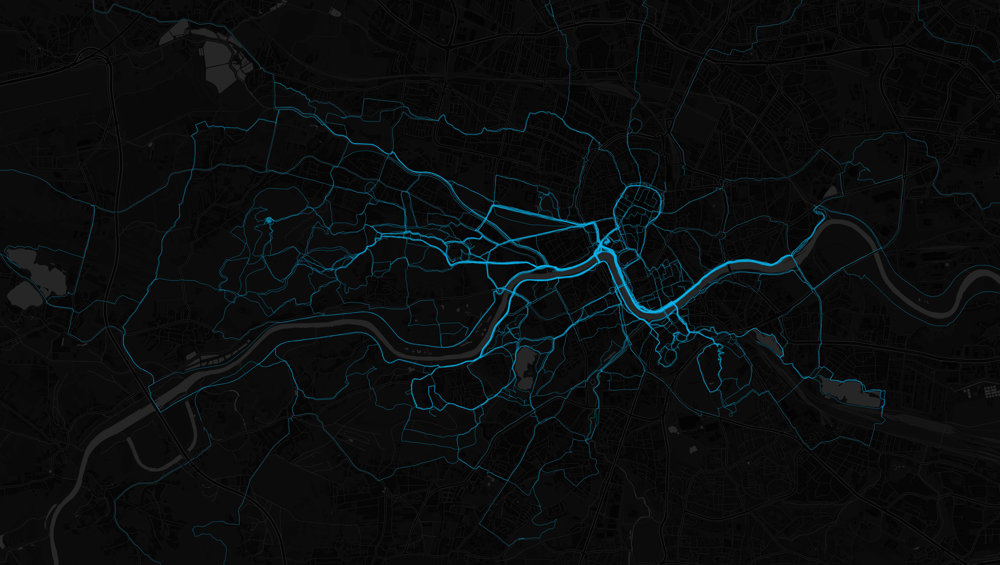

One of my big goals this year was to run 1,000 miles. As of yesterday, I’ve done it!

Running has been especially important to me because of coronavirus stresses and living in a foreign country. I find it really helpful as a grounding technique—it forces me to be immersed in the physical world and be aware of physical discomforts. Having an ambitious and achievable goal also helps keep me positive and stick to a regular running schedule.

My favorite part of running is exploration. In a new city, running lets me see the sights and tour the area without a plan or obligation. In my current city, I end up finding all sorts of hidden treasures and trails that most people never see. I usually open up a map in my area and try to connect the green areas using [Strava’s global heatmap](https://www.strava.com/heatmap#12.04/19.88822/50.05018/hot/all).

Some highlights include seeing the old town and some local parks in Gdansk, exploring [several](https://www.strava.com/activities/3592985128) [national](https://www.strava.com/activities/3085728868) parks, a [snowy night run in Slovakia](https://www.strava.com/activities/3045963732), and [seeing castles](https://www.strava.com/activities/3429526207) along Szlak Orlich Gniazd (the Trail of the Eagle's Nests). On the other hand, I've had some not-so-fun runs, including [10 kilometers](https://www.strava.com/activities/3293525889) on the same 0.2km stretch of cobble in my apartment complex during coronavirus lockdown, some smoggy morning winter runs, and [my longest and farthest run](https://www.strava.com/activities/3785491674) to date---28 miles for my 28th birthday over 4 hours and 20 minutes.

<figure>



<figcaption>Three of the four mounds of Kraków</figcaption>

</figure>

<figure>



<figcaption>Lockdown running in my apartment courtyard, Southern Poland, Masurian Lake District</figcaption>

</figure>

Another aspect I enjoy is tracking statistics. I've used [Strava](https://www.strava.com/athletes/14856714) for the last couple of years to store my historical running information. Throughout my 1,000 miles, I've spent almost six full days moving, climbed 54,775 feet (almost twice the height of Mount Everest), and burned an extra 114,267 calories (around 60 days worth of food for the average person).

<figure>

<figcaption>Cumulative distance over time</figcaption>

</figure>

	

You can see [more data here](https://observablehq.com/d/bda8bfd8f9e500a9).

<small style="display: block">Maps generated with <https://github.com/erik/derive>. Background imagery from [CartoDB](https://carto.com/attribution/).</small>
