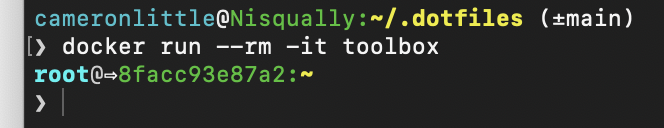

In my work and personal life, most of the services I deploy these days run in containers, and I need to debug them frequently. Last year, I set up some automation to maintain a "toolbox" docker image that's pre-configured with my [dotfiles](https://github.com/apexskier/dotfiles) and the tools I use day-to-day.

Generally, I try to follow standard conventions in my personal configuration. I try to use the command line in a way that I don't feel like I'm constantly stumbling in unfamiliar environments like remote servers, docker images such as [`node`](https://hub.docker.com/_/node) or [`golang`](https://hub.docker.com/_/golang), or a fresh Raspberry Pi. This practice also makes it much easier to help my coworkers—I can work within their terminal or help instruct them without needing to translate commands. It can be painful to watch someone with muscle memory for custom <a rel="noreferrer" href="https://gist.github.com/mwhite/6887990#my-aliases">git aliases</a> or non-standard shells working in a freshly provisioned EC2 instance.

Even considering these benefits, a lot of customization provides more than enough value to be worthwhile. A familiar shell makes the debugging experience much more pleasant, and installing the tools I need to investigate takes time. I've also spent years polishing my bash prompt, and I love using it.



My most common use case is debugging docker and Kubernetes networking behavior. For example, I can spin up a pod in our cluster running the toolbox image and use `curl` and `dig` to verify DNS behavior.

I also occasionally need to run an image that takes a long time to start or run using a wrapper utility that doesn't bind ports on my host. In this case, I can run my toolbox within a local docker network and connect to the image without needing to restart it or dig into the internals of how it's initialized.

Keeping my toolbox image up to date is automated directly in my [dotfiles repository](https://github.com/apexskier/dotfiles/), using the same scripts I use when setting up a new computer. Whenever I push to the default branch, a [GitHub action](https://github.com/apexskier/dotfiles/actions/workflows/dockerpublish.yml) builds the image and publishes it to GitHub's container registry[^1].

[^1]: I also publish to Docker Hub, which I used before GitHub supported anonymous container access.

The docker image builds from `debian:stable-slim`, copies my dotfiles, runs my installer and setup scripts, then runs `bash`. Putting this together was a nice way to verify the cross-compatibility of my setup. The only serious issue I ran into was ensuring my setup scripts could run non-interactively. I also took the opportunity to double-check that my dotfiles don't contain too much personal information (like a preconfigured git user) to let other people use my setup without accidentally impersonating me.

Try it yourself by running

```sh
docker run --rm -it ghcr.io/apexskier/dotfiles/toolbox
```

You can [read more about it](https://github.com/apexskier/dotfiles#docker-image) and see [exactly what's installed](https://github.com/apexskier/dotfiles/blob/main/Dockerfile) by visiting my dotfiles.