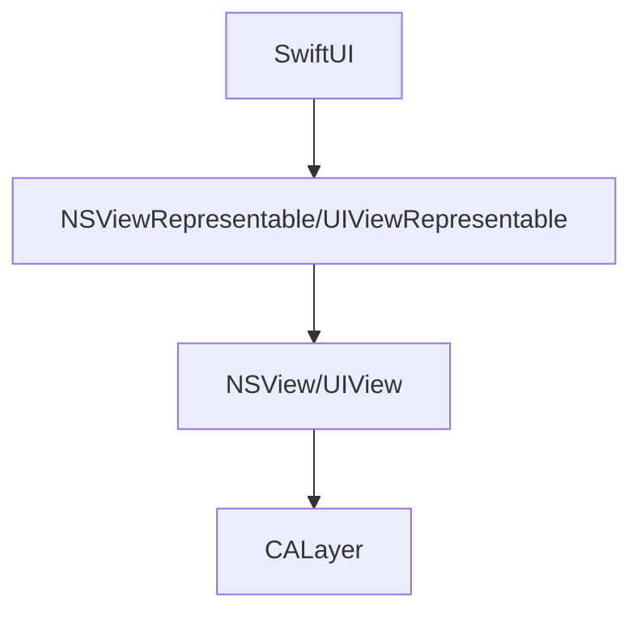

A project I've recently started heavily uses Core Animation. The app runs on macOS and iOS and relies on a custom CALayer subclass. Apple has provided [bridges between SwiftUI and AppKit or UIKit animations](https://developer.apple.com/documentation/swiftui/unifying-your-app-s-animations) but doesn't provide guidance on how to bridge to Core Animation.

I've been working on solving this problem. Though it's not perfect, this post describes what I've come up with.

For convenience, the example code in this post uses UIKit only and is simplified to focus on the essentials. Full code (runnable on iOS and macOS) can be found in the [sample code GitHub repository](https://github.com/apexskier/swiftui-coreanimation). I assume familiarity with SwiftUI and Core Animation basics in this article, as Apple and others provide good documentation.

## Architecture

First, we need to connect SwiftUI to the Core Animation layer. This uses [`UIViewRepresentable`](https://developer.apple.com/documentation/swiftui/uiviewrepresentable) and [`UIView`](https://developer.apple.com/documentation/uikit/uiview) (AppKit's `NS` equivalents on macOS).



## Data flow
 
Our animatable property can be passed through each of these layers. This is simpler with one-way data binding, but by providing access to the SwiftUI binding through the `UIViewRepresentable`'s coordinator, my example code is bidirectional.

Here's how our animatable `value` is passed from SwiftUI into our `CALayer`'s draw function.

```swift
struct ContentView: some View {
    @State var value = 0.0 // source of truth

    var body: some View {
        CustomSwiftUIView(value: value)
    }
}

struct CustomSwiftUIView: UIViewRepresentable {
    @Binding var value: Double

    func makeUIView(context: Context) -> CustomPlatformView {
        let view = CustomPlatformView()
        // this link allows our UIView to write value (and read if needed outside of standard SwiftUI updates)
        view.delegate = context.coordinator
        return view
    }

    func updateUIView(_ uiView: CustomPlatformView, context: Context) {
        // this "pushes" changes into our CALayer reactively, following standard SwiftUI updates
        (view.layer as? CustomLayer)?.update(
            with: context.transaction,
            value: value
        )
    }

    // The coordinator provides access to the value binding from CustomPlatformView
    class Coordinator: NSObject, CustomDelegate {
        var parent: CustomSwiftUIView

        init(_ parent: CustomSwiftUIView) {
            self.parent = parent
        }
    }

    func makeCoordinator() -> Coordinator {
        Coordinator(self)
    }
}

class CustomPlatformView: UIView {
    // this coordinator provides read/write access to the value
    // for example, a custom gesture recognizer could update the binding
    var coordinator: CustomSwiftUIView.Coordinator?

    override class var layerClass: AnyClass {
        CustomLayer.self
    }
}

class CustomLayer: CALayer {
    @NSManaged var value: CGFloat // animatable property

    override func draw(in ctx: CGContext) {
        // use `value` as needed
    }

    func update(with transaction: SwiftUI.Transaction, value: Double) {
        // we'll fill this in later to respect animations
        self.value = value
    }
}
```

To summarize why we need each copy of `value`:

* `ContentView`: This is our main source of truth and should be considered the canonical one. SwiftUI and most reactive UI frameworks require top-down state passing.
* `CustomSwiftUIView`: Also inherent in SwiftUI is the data propagation model: passing properties throughout the hierarchy with a single source of truth. Because this is a binding, we can read and write it, but it could be a plain `var` if read-only access is needed.
* `CustomLayer`: This is needed for Core Animation to store intermediate values representing state mid-animation. Core Animation duplicates this again within the ["model" and "presentation" parts of the layer tree](https://developer.apple.com/library/archive/documentation/Cocoa/Conceptual/CoreAnimation_guide/CoreAnimationBasics/CoreAnimationBasics.html#//apple_ref/doc/uid/TP40004514-CH2-SW19). Writing to this value directly will result in state drift, you must use the `Coordinator` instead.

Note that we do not need to store the `value` inside the `UIView` layer. (In theory, we could move the drawing code into the `UIView`, but that kind of defeats the point of this post.) Instead, `UIView` relies on the `Coordinator`.

## Animation

Now that we can read and write our animatable value, we want to animate it. Our goal is to drive all animation from a single place. Additionally, we'd like to use the most modern methods. For these reasons, and because we have to, we'll use SwiftUI syntax.

```swift
Button {
    withAnimation {
        value = 0.5
    }
} label: {
    Text("Animate Value")
}
```

### Custom CALayer Properties

First, we need to enable Core Animation for our custom `value` property. Two things are required:

1. Make `value` dynamic by specifying `@NSManaged`
2. Ensure Core Animation redraws when `value` changes

```swift
class CustomLayer: CALayer {
    static private let animationKeyPath = \CustomLayer.value
    static private var nsAnimationKeyPath: String {
        NSExpression(forKeyPath: animationKeyPath).keyPath
    }
    
    @NSManaged var value: CGFloat
    
    override class func needsDisplay(forKey key: String) -> Bool {
        key == nsAnimationKeyPath || super.needsDisplay(forKey: key)
    }
}
```

### Bridging Transactions

The core component of this technique is using SwiftUI's [`Transaction`](https://developer.apple.com/documentation/swiftui/transaction) to determine if an animation is active when a property is changed. SwiftUI provides this in the context of a view representable's update, which we can pass directly into our custom `CALayer`'s `update`.

```swift
struct CustomSwiftUIView: UIViewRepresentable {
    func updateUIView(_ uiView: CustomPlatformView, context: Context) {
        (uiView.layer as? CustomLayer)?.update(
            with: context.transaction,
            value: value
        )
    }
}

class CustomLayer: CALayer {
    static private let animationKey = "value-animation-key"

    func update(with transaction: SwiftUI.Transaction, value: Double) {
        // additional animation management is omitted

        if let animation = transaction.animation {
            // create Core Animation CAAnimation from transaction.animation
            let caAnimation: CAAnimation = ...
            add(caAnimation, forKey: animationKey)
        }
    }
}
```

### Bridging Animations

Now, we need to transform the `SwiftUI.Animation` into a `CAAnimation`. This is a little more complicated. `SwiftUI.Animation` is fairly opaque. It doesn't provide access to the type of animation, its configuration, or any way to execute itself as a function.

Instead, we use the fairly hacky technique of parsing the animation's [`description`](https://developer.apple.com/documentation/Swift/CustomStringConvertible) and extracting parameters from it.

This is fairly straightforward for spring animations:

```swift
nonisolated(unsafe) let fluidSpringAnimationRegex =
#/FluidSpringAnimation\(response: (?<response>\d+\.\d+), dampingFraction: (?<dampingFraction>\d+\.\d+), blendDuration: (?<blendDuration>\d+\.\d+)\)/#

if let springParameters = try fluidSpringAnimationRegex.wholeMatch(in: description) {
    let caAnimation = CASpringAnimation()
    let response = CGFloat(Float(springParameters.response)!)
    let dampingFraction = CGFloat(Float(springParameters.dampingFraction)!)
    let omegaN = 2 * .pi / response
    caAnimation.stiffness = omegaN * omegaN * mass
    caAnimation.damping = dampingFraction * 2 * sqrt(caAnimation.stiffness * caAnimation.mass)
    return caAnimation
}

nonisolated(unsafe) let springAnimationRegex =
#/SpringAnimation\(mass: (?<mass>-?\d+\.\d+), stiffness: (?<stiffness>-?\d+\.\d+), damping: (?<damping>-?\d+\.\d+), initialVelocity: SwiftUI._Velocity<Swift.Double>\(valuePerSecond: (?<initialVelocity>-?\d+\.\d+)\)\)/#

if let springParameters = try springAnimationRegex.wholeMatch(in: description) {
    let caAnimation = CASpringAnimation()
    caAnimation.mass = CGFloat(Float(springParameters.mass)!)
    caAnimation.stiffness = CGFloat(Float(springParameters.stiffness)!)
    caAnimation.damping = CGFloat(Float(springParameters.damping)!)
    caAnimation.initialVelocity = CGFloat(Float(springParameters.initialVelocity)!)
    return caAnimation
}
```

And we can fairly easily recreate Apple's default animation:

```swift
if description == "DefaultAnimation()" {
    // defaults changed in more recent versions
    if #available(iOS 17, macOS 14, tvOS 17, watchOS 10, *) {
        let caAnimation = CASpringAnimation()
        caAnimation.apply(response: 0.55, dampingFraction: 1)
        return caAnimation
    } else {
        let caAnimation = CABasicAnimation()
        caAnimation.timingFunction = .init(name: .easeInEaseOut)
        caAnimation.duration = 0.35
        return caAnimation
    }
}
```

However, traditional bezier animation curves are more difficult. SwiftUI produces descriptions that can be regex matched using:

```swift
#/BezierAnimation\(duration: (?<duration>\d+\.\d+), curve: \(extension in SwiftUI\):(?<cubicSolver>SwiftUI.UnitCurve.CubicSolver\(ax: (?<ax>-?\d+\.\d+), bx: (?<bx>-?\d+\.\d+), cx: (?<cx>-?\d+\.\d+), ay: (?<ay>-?\d+\.\d+), by: (?<by>-?\d+\.\d+), cy: (?<cy>-?\d+\.\d+)\))\)/#
```

However, I haven't yet been able to figure out what the cubic solver is and how to convert its three two-dimensional coordinates (`(ax, ay), (bx, by), (cx, cy)`) into a bezier curve's two two-dimensional control points ([`CAMediaTimingFunction.init(controlPoints:_:_:_:)`](https://developer.apple.com/documentation/quartzcore/camediatimingfunction/1522235-init)).

For now, I've resorted to explicitly matching against standard timing curves I can explicitly create using SwiftUI and Core Animation. For example, ease in's cubic solver is:

```
SwiftUI.UnitCurve.CubicSolver(ax: -0.7400000000000002, bx: 0.4800000000000002, cx: 1.26, ay: -2.0, by: 3.0, cy: 0.0)
```

And the Core Animation instance is:

```swift
let caAnimation = CABasicAnimation()
caAnimation.duration = Double(bezierParameters.duration)!
switch bezierParameters.cubicSolver {
case easeInAnimationCubicSolver:
    caAnimation.timingFunction = .init(name: .easeIn)
}
return caAnimation
```

Once the animation is created, we configure the keypath it modifies, and its start and end values without our layer's `update` function. We also need to ensure we update the spring animation's duration, as it depends on the value's range. Core Animation will cut off the animation without this.

```swift
self.value = value

if let caAnimation = transaction.animation?.caAnimation {
    caAnimation.keyPath = Self.nsAnimationKeyPath
    caAnimation.fromValue = (presentation() ?? self).value
    caAnimation.toValue = value
    if let caAnimation = caAnimation as? CASpringAnimation {
        // Core Animation will cut off the animation if the duration is not updated
        caAnimation.duration = caAnimation.settlingDuration
    }

    add(caAnimation, forKey: Self.animationKey)
}
```

## Final Result

For my final demo, I want to draw something that shows `value` animating. I'll draw a circle that will animate through the vertical center axis of the view. I'll also print the value as text to visually guarantee it's changing.

```swift
let diameter = 20.0

override func draw(in ctx: CGContext) {
    ctx.clear(bounds)

    // set graphics context to support NSString drawing
    UIGraphicsPushContext(ctx)
    "\(value)".draw(
        in: bounds,
        withAttributes: fontAttributes
    )

    ctx.setFillColor(CGColor(red: 1, green: 0, blue: 0, alpha: 1))
    ctx.fillEllipse(
        in: CGRect(
            origin: CGPoint(
                x: (bounds.width - diameter) / 2,
                y: (bounds.height - diameter) * value
            ),
            size: CGSize(width: diameter, height: diameter)
        )
    )
}
```

Another feature I want to show is bidirectional data binding. When you click or tap on the custom view, it will interrupt the animation and set the parent to the current state, to keep everything in sync. We can also animate changes from the internal view using the same SwiftUI `withAnimation` function.

```swift
@objc func handleTap(gestureRecognizer: UIGestureRecognizer) {
    guard let coordinator else { return }
    coordinator.parent.value = (presentation() ?? self).value
    removeAnimation(forKey: Self.animationKey)
}

@objc func handleDoubleTap(gestureRecognizer: UIGestureRecognizer) {
    guard let coordinator else { return }
    withAnimation {
        coordinator.parent.value = (presentation() ?? self).value > 0.5 ? 0 : 1
    }
}
```

Complete code with an example app and Xcode project can be found at https://github.com/apexskier/swiftui-coreanimation.

<figure>
    <video src="https://content.camlittle.com/swiftui-caanimation%20-%20swiftui-caanimation%20-%202024-11-14%20at%2017.41.53-converted.mp4" width="420" controls muted></video>
    <figcaption>Final demo of animation</figcaption>
</figure>

## Taking it further

I'm pretty happy with this approach, especially the ability to drive animations from multiple layers in the stack using the same mechanism. However, it's not ideal for a few reasons.

From [the SwiftUI `spring` documentation](https://developer.apple.com/documentation/swiftui/animation/spring):

> When mixed with other `spring()` or `interactiveSpring()` animations on the same property, each animation will be replaced by their successor, preserving velocity from one animation to the next. Optionally blends the response values between springs over a time period.

My approach does neither of these things. In theory, when an animated update propagates while an animation is in progress, we could look up the current animation and set the new animation's initial velocity appropriately. The blocker is the opaqueness of CAAnimations, which don't provide APIs for access to value or velocity at a given time.

Blending response values is even more difficult, as it would require dynamically changing `CAAnimation`s over time, which isn't supported.

As mentioned above, I haven't figured out SwiftUI's `CubicSolver`, which I think is a private struct implementing `UnitCurve`. It represents at least bezier curves, but I haven't figured out the math or how it works. If you have any ideas, please get in touch!

Ultimately, these issues are due to the closed nature of SwiftUI and other Apple UIs. At the core, animation curves are math. Standard curves are simple functions over time (`f(time) = value`). Springs are more complex since they're semi-stateful by taking the animated value into account, but are also deterministic. I'd like to be able to directly call these functions. Unfortunately, `CABasicAnimation` has no support for this. At first glance at the documentation, SwiftUI's `Animation` appears to support this with [`func animate<V>(value: V, time: TimeInterval, context: inout AnimationContext<V>) -> V?`](https://developer.apple.com/documentation/swiftui/animation/animate(value:time:context:)). However, I have not found a way to get ahold of an `AnimationContext` outside of a custom Animation subclass, which makes this non-viable. SwiftUI's `UnitCurve` has [`value(at:)`](https://developer.apple.com/documentation/swiftui/unitcurve/value(at:)) and [`velocity(at:)`](https://developer.apple.com/documentation/swiftui/unitcurve/velocity(at:)) functions that are exactly what I want, but don't have a spring equivalent, and `UnitCurve`s aren't accessible from `Animation`. I could directly implement timing curve functions, but I'd prefer something built-in to avoid building it from scratch.
