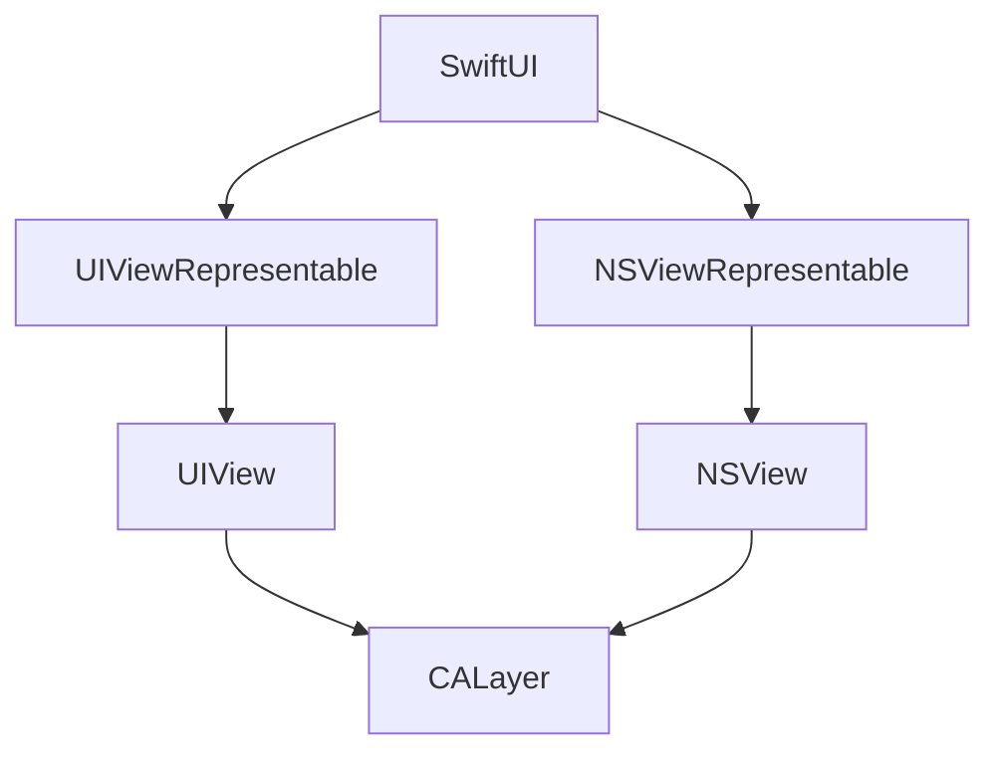

A project I've recently started makes heavy use of Core Animation. The app crosses macOS (AppKit) and iOS (UIKit), and relies on custom CALayer's. Apple has provided bridges between SwiftUI animations and AppKit or UIKit animations (https://developer.apple.com/documentation/swiftui/unifying-your-app-s-animations), but doesn't provide guidance on how to bridge to Core Animation.

I've been working on solving this problem, and though it's not perfect, here's what I've come up with.

For convenience, I'm going to write the example code in this post using UIKit only. Full macOS code can be found in the attached GitHub repository.

## Architecture

First, we need to connect SwiftUI to the Core Animation layer. This is done using [`NSViewRepresentable`](https://developer.apple.com/documentation/swiftui/nsviewrepresentable) / [`UIViewRepresentable`](https://developer.apple.com/documentation/swiftui/uiviewrepresentable) and [`NSView`](https://developer.apple.com/documentation/appkit/nsview) / [`UIView`](https://developer.apple.com/documentation/uikit/uiview) (on macOS / iOS respectively).



## Data flow
 
Our animatable property can be passed through each of these layers. This is simpler with one-way data binding, but bidirectional is also possible using the View Representable's coordinator. For completeness, we'll handle bidirectional in this example.

This shows how our animatable `value` is passed from SwiftUI into the `CALayer`'s drawing code. (Pseudocode, there's some additional work needed.)

```swift
struct ContentView: some View {
    @State var value = 0.0 // source of truth

    var body: some View {
        CustomSwiftUIView(value: value)
    }
}

struct CustomSwiftUIView: UIViewRepresentable {
    @Binding var value: Double

    func makeUIView(context: Context) -> CustomPlatformView {
        let view = CustomPlatformView()
        view.delegate = context.coordinator
        return view
    }

    func updateUIView(_ uiView: CustomPlatformView, context: Context) {
        (view.layer as? CustomLayer)?.update(
            with: context.transaction,
            value: value
        )
    }

    class Coordinator: NSObject, CustomDelegate {
        var parent: CustomSwiftUIView

        init(_ parent: CustomSwiftUIView) {
            self.parent = parent
        }
    }

    func makeCoordinator() -> Coordinator {
        Coordinator(self)
    }
}

class CustomPlatformView: UIView {
    // this coordinator provides read/write access to the value
    var coordinator: CustomSwiftUIView.Coordinator?

    override class var layerClass: AnyClass {
        CustomLayer.self
    }
}

class CustomLayer: CALayer {
    @NSManaged var value: CGFloat // animatable property

    override func draw(in ctx: CGContext) {
        // use `value` as needed
    }

    func update(with transaction: SwiftUI.Transaction, value: Double) {
        // we'll fill this in later to respect animations
        self.value = value
    }
}
```

As a rule of thumb we avoid duplicate sources of truth for any state. To summarize why we need each copy of `value`

* `ContentView`: This is our main source of truth and should be considered the canonical one. SwiftUI requires this.
* `CustomSwiftUIView`: This is a requirement by SwiftUI, and SwiftUI will ensure this value is kept in sync with its parent. Because this is a binding, we can read and write it.
* `CustomLayer`: This is needed for Core Animation to store intermediate values representing state mid-animation. Core Animation will duplicate this again within the ["model" and "presentation" parts of the layer tree](https://developer.apple.com/library/archive/documentation/Cocoa/Conceptual/CoreAnimation_guide/CoreAnimationBasics/CoreAnimationBasics.html#//apple_ref/doc/uid/TP40004514-CH2-SW19). Writing requires going through the `Coordinator`, otherwise state will drift between the two ends of the archetecture.

Note that we do not need to store the `value` inside the `UIView` layer. (In theory, we could move the drawing code code into the `UIView`, but that kind of defeats the point of this post.) Instead, `UIView` can purely rely on the `Coordinator`

## Animation

Now that we can read and write our animatable value, we want to animate it. Our goal is to drive all animation from a single place. Additionally, we'd like to use the most modern methods. For these reasons, and because we have to, we'll use SwiftUI syntax.

```swift
Button {
    withAnimation {
        value = 0.5
    }
} label: {
    Text("Animate Value")
}
```

### Core Animation

First, we need to enable Core Animation for our custom `value` property. Two things are required:

1. Make `value` dynamic by specifying `@NSManaged`
2. Ensure Core Animation redraws when `value` changes

```swift
class CustomLayer: CALayer {
    static private let animationKeyPath = \CustomLayer.value
    static private var nsAnimationKeyPath: String {
        NSExpression(forKeyPath: animationKeyPath).keyPath
    }
    
    @NSManaged var value: CGFloat
    
    override class func needsDisplay(forKey key: String) -> Bool {
        key == nsAnimationKeyPath || super.needsDisplay(forKey: key)
    }
}
```

### Bridging Transactions

The core component of this technique is using SwiftUI's [`Transaction`](https://developer.apple.com/documentation/swiftui/transaction) to determine if an animation is active when a property is changed. Transaction is directly available in `UIViewRepresentable.updateUIView(Self.UIViewType, context: Self.Context)`'s `context.transaction`. We then pass it directly into our custom `CALayer`'s `update` method.

```swift
class CustomLayer: CALayer {
    static private let animationKey = "value-animation-key"

    update(with transaction: SwiftUI.Transaction, value: Double) {
        CATransaction.begin()

        removeAnimation(forKey: animationKey)

        // create Core Animation CAAnimation
        let caAnimation: CAAnimation = // ...

        add(caAnimation, forKey: animationKey)

        CATransaction.commit()

        setNeedsDisplay()
    }
}
```

The `CATransaction` isn't strictly necessary, but helps when batching multiple animations together.

Now, we need to transform the `SwiftUI.Animation` into a `CAAnimation`. This is a little more complicated. `SwiftUI.Animation` is fairly opaque. It doesn't provide access to the type of animation, any of its parameters, or any way to execute itself as a function.

Instead, we use the fairly hacky technique of parsing the animation's [`description`](https://developer.apple.com/documentation/Swift/CustomStringConvertible) and extracting parameters from it.

This is fairly straightforward for spring animations:

```swift
nonisolated(unsafe) let fluidSpringAnimationRegex =
#/FluidSpringAnimation\(response: (?<response>\d+\.\d+), dampingFraction: (?<dampingFraction>\d+\.\d+), blendDuration: (?<blendDuration>\d+\.\d+)\)/#

if let springParameters = try fluidSpringAnimationRegex.wholeMatch(in: description) {
    let caAnimation = CASpringAnimation()
    let response = CGFloat(Float(springParameters.response)!)
    let dampingFraction = CGFloat(Float(springParameters.dampingFraction)!)
    let omegaN = 2 * .pi / response
    caAnimation.stiffness = omegaN * omegaN * mass
    caAnimation.damping = dampingFraction * 2 * sqrt(caAnimation.stiffness * caAnimation.mass)
    return caAnimation
}

nonisolated(unsafe) let springAnimationRegex =
#/SpringAnimation\(mass: (?<mass>-?\d+\.\d+), stiffness: (?<stiffness>-?\d+\.\d+), damping: (?<damping>-?\d+\.\d+), initialVelocity: SwiftUI._Velocity<Swift.Double>\(valuePerSecond: (?<initialVelocity>-?\d+\.\d+)\)\)/#

if let springParameters = try springAnimationRegex.wholeMatch(in: description) {
    let caAnimation = CASpringAnimation()
    caAnimation.mass = CGFloat(Float(springParameters.mass)!)
    caAnimation.stiffness = CGFloat(Float(springParameters.stiffness)!)
    caAnimation.damping = CGFloat(Float(springParameters.damping)!)
    caAnimation.initialVelocity = CGFloat(Float(springParameters.initialVelocity)!)
    return caAnimation
}
```

And we can fairly easily recreate Apple's default animation:

```swift
if description == "DefaultAnimation()" {
    // defaults changed in more recent versions
    if #available(iOS 17, macOS 14, tvOS 17, watchOS 10, *) {
        let caAnimation = CASpringAnimation()
        caAnimation.apply(response: 0.55, dampingFraction: 1)
        return caAnimation
    } else {
        let caAnimation = CABasicAnimation()
        caAnimation.timingFunction = .init(name: .easeInEaseOut)
        caAnimation.duration = 0.35
        return caAnimation
    }
}
```

However, traditional bezier animation curves are more difficult. SwiftUI produces descriptions that can be regex matched using:

```swift
#/BezierAnimation\(duration: (?<duration>\d+\.\d+), curve: \(extension in SwiftUI\):(?<cubicSolver>SwiftUI.UnitCurve.CubicSolver\(ax: (?<ax>-?\d+\.\d+), bx: (?<bx>-?\d+\.\d+), cx: (?<cx>-?\d+\.\d+), ay: (?<ay>-?\d+\.\d+), by: (?<by>-?\d+\.\d+), cy: (?<cy>-?\d+\.\d+)\))\)/#
```

However, I haven't yet been able to figure out what the cubic solver actually is and how to convert it's three two-dimensional coordinates (`(ax, ay), (bx, by), (cx, cy)`) into a bezier curve's two two-dimensional control points ([`CAMediaTimingFunction.init(controlPoints:_:_:_:)`](https://developer.apple.com/documentation/quartzcore/camediatimingfunction/1522235-init)).

For now, I've resorted to explicitly matching against standard timing curves I can explicitly create using SwiftUI and Core Animation. For example, ease in's cubic solver is:

```
SwiftUI.UnitCurve.CubicSolver(ax: -0.7400000000000002, bx: 0.4800000000000002, cx: 1.26, ay: -2.0, by: 3.0, cy: 0.0)
```

And the Core Animation instance is:

```swift
let caAnimation = CABasicAnimation()
caAnimation.duration = Double(bezierParameters.duration)!
switch bezierParameters.cubicSolver {
case easeInAnimationCubicSolver:
    caAnimation.timingFunction = .init(name: .easeIn)
}
return caAnimation
```

Once the animation is created, we apply the keypath it modifies and its start and env values without our layer's `update` function:

```swift
let fromValue = (presentation() ?? self).value
let toValue = CGFloat(value)
self.value = toValue

removeAnimation(forKey: Self.animationKey)

if let caAnimation = transaction.animation?.caAnimation {
    switch caAnimation {
    case let caAnimation as CASpringAnimation:
        caAnimation.keyPath = Self.nsAnimationKeyPath
        caAnimation.fromValue = fromValue
        caAnimation.toValue = toValue
        caAnimation.duration = caAnimation.settlingDuration
    case let caAnimation as CABasicAnimation:
        caAnimation.keyPath = Self.nsAnimationKeyPath
        caAnimation.fromValue = fromValue
        caAnimation.toValue = toValue
    default:
        fatalError("Unsupported animation type \(caAnimation)")
    }

    add(caAnimation, forKey: Self.animationKey)
}
```

## Final Result

Complete code with an example app and Xcode project can be found at https://github.com/apexskier/swiftui-coreanimation.


---

When reading the documentation, I'd hope to be able to use `func animate<V>(value: V, time: TimeInterval, context: inout AnimationContext<V>) -> V?`, but I have not found a way to get ahold of an `AnimationContext` outside of a custom Animation subclass.

Areas for improvement:

Maintain velocity of CAAnimation
