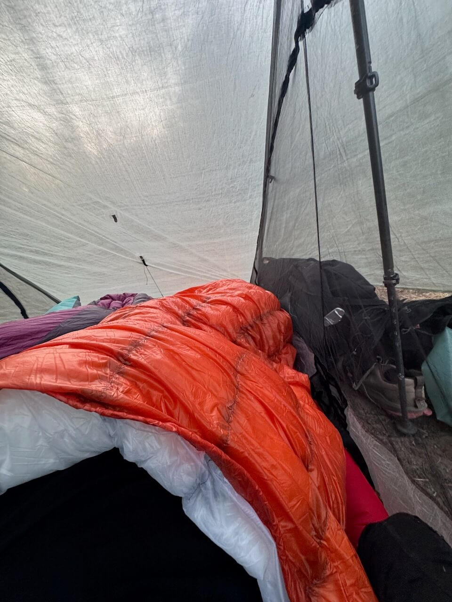

I recently made my own backpacking quilt. This was the largest <abbr title="make your own gear">MYOG</abbr> project I've attempted, and I'm satisfied with how it turned out.

## Materials

I've used Ripstop by the Roll in the past, and I still think they're best general source for MYOG projects (wide selection, good pricing, although shipping isn't great).

* **[0.66 oz MEMBRANE 10 Taffeta Nylon](https://ripstopbytheroll.com/products/0-66-oz-membrane-10-taffeta-nylon-1)**: One of the lightest options, fully downproof, and a nice feeling
* **[0.5 oz Noseeum Mesh](https://ripstopbytheroll.com/products/0-5-oz-ns50-noseeum-mesh)**: I cut 3.5" strips from this, as it's lighter than the precut baffle tape
* **[Gutermann Tera 80 thread](https://ripstopbytheroll.com/products/gutermann-tera-80-thread)**
* **[Grosgrain ribbon](https://ripstopbytheroll.com/products/mil-spec-nylon-grosgrain-ribbon)**: 3/8" and 3/4" widths
* **[Low profile center push buckles](https://ripstopbytheroll.com/products/low-profile-center-push-buckle)**
* **[1/16" Shock Cord](https://ripstopbytheroll.com/products/shock-cord)**
* **[Anchorable Cordlock](https://ripstopbytheroll.com/products/anchorable-cordlock)** (glow-in-the-dark, so I can find them at night)
* **[900 FP goose down](https://www.amazon.com/dp/B073T8NQT5?ref_=ppx_hzsearch_conn_dt_b_fed_asin_title_1)** (from Amazon)

I considered 0.56 oz nylon, but my research concluded the weight savings weren't worth the durability decrease.

The goose down is my main risk on this project. It's not treated to handle water and is from an unknown source, but is way cheaper than [RSBR's 850 DWR down](https://ripstopbytheroll.com/products/hyperdry-850-fp-dwr-goose-down). Since I'm currently in a drier climate, I'm taking a risk on moisture management. Although I think the supplier shorted me a bit on weight (I think the 1 lb includes the bag it's shipped in), I'm reasonably happy with it.

## Patterning

I mostly did my own patterning. [Dubber Designs has a generator](https://dubberdesigns.com/downloads/down-quilt-pattern-generator/), but I wasn't able to import it properly into Apple Numbers or Google Sheets. It did provide some good guidance on down calculations. [Ripstop by the Roll has a one-pager](https://cdn.shopify.com/s/files/1/0261/6507/files/How_to_Make_a_Quilt.pdf?v=1727186891), but I didn't do a full taper like they do.

[vanCapare](https://www.reddit.com/r/myog/comments/w4im76/partial_box_baffle_quilt_membrane_7_noseeum_900fp/), [HollowCartographer](https://www.reddit.com/r/myog/comments/13x3si1/first_down_backpacking_quilt/), and [durianbae](https://www.reddit.com/r/myog/comments/zdhlip/made_my_own_ultralight_sleeping_bag_quilt/) were good sources of inspiration on Reddit.

[My rough down calculations are in Google Sheets.](https://docs.google.com/spreadsheets/d/12EN9bKKhYVg3KWGNHM6rn6EtfmkH-3rTnbDq5mud7SA/edit?usp=sharing)

Some of my decisions were:

- Long enough to fully cover my head. I generally sleep with my head fully covered and didn't want to construct a separate hood.
- Partial taper around the legs. I get some weight savings this way, and it accommodates my side-sleeping.
- Four sleeping pad straps spaced along the body.
- Fully closed footbox. This means I don't have a cinch at the foot, and prevents slipping off the pad.

My final measurements:

- 50" width
- 78" height
- 34" long taper, down to 35" wide at the toes
- Baffles are 3" thick and approximately 5" wide (10 vertical baffles, 6 horizontal baffles, and 2 in the footbox)
- ~10% overstuff

This required two shapes, cut twice for the top and bottom. The arc in the footbox's length is the same length as the width of the bottom of the main body.

## Baffles

Baffle design is a deep topic on its own, with [a lot of options](https://www.reddit.com/r/Ultralight/comments/lbvrtv/battle_of_the_baffles_horizontal_vertical_chevron/).

I seriously considered Karo baffles, but because I have experience sewing box baffles (from a pair of down pants I made my wife a few Christmases ago), I was confident enough to attempt them again.

I decided on a split vertical/horizontal design: upper body vertical and lower body horizontal. This seems to be the most popular option for DIY projects. Vertical avoids down clumping on the sides while sleeping, but it does make stitching a more complex (since you're sewing along the long edge in a narrow tube). Horizontal is easier to construct, but down can clump at the sides when sleeping.

I do think chevron or diagonal designs could have benefits, but the complexity and margin for error seem quite a bit higher.

## Construction

Construction of box baffling requires thinking inside out.

1. I started by sewing the box baffles on the wrong side of the bottom side layer of fabric. I tried to curve along the baffle material from my seam allowance to the center at the edges of my fabric, which adds a rounded finished edge.

2. I then sewed the footbox's arc onto the base of the main body of the quilt.

3. Then, I sewed along the edge of the entire quilt except the top edge, wrong side to wrong side. This includes my straps, ensuring they're on the inside. I now have an inside-out quilt, with box baffles sewn to one side, with raw edges exposed. When I flip this right side out, the edges are nicely finished, and my straps are exposed.

4. To fill with down, I used a length of PVC and PEX. I 3D-printed a removable cap for the PVC and a pusher to attach to the PEX. I filled and measured down into the PVC on a scale, slid the open end into my space to fill, removed the cap, and pushed the down into the cavity.

5. The next step is the most tedious. Working inside out from the base of the quilt, I sewed the unattached side of each box baffle to the wrong side of the top fabric. When I had 5 or so inches left to sew, I paused (with my needle down) and filled with the correct amount of down. Marking my lines was pretty tricky here, as the quilt was no longer a flat shape.

6. To finish the top edge I sewed a straight stitch, leaving a rough edge exposed. I then attached 3/8" grosgrain loops with my cordlocks attached. I then made a strip of bias tape with a double fold and finished ends, and sewed it on to cover the rough edge. Finally, I fed my shock cord through to finish it off.

## Final product

The final product is around 22 oz and was more than warm enough for under 40℉.

## Learnings

- The most common error I made was letting the fabric fold under itself while sewing, meaning I was sewing into an additional layer. I needed to pick this out and redo it each time.
- It was really difficult to mark up and keep accurate lines when I was partially through sewing. I'd prefer to figure out a method to fully mark out sewing lines while the fabric is flat. I need to find something better than chalk for this, as it needs to hold up through the several days of sewing.
- I'm not sure if the head cinch is necessary, based on how I sleep. Similarly, I don't know if I need the strap closest to my head.
- If I were to redo this, I'd go with a shorter baffle with more overstuffing, to avoid down movement and save a little weight.

